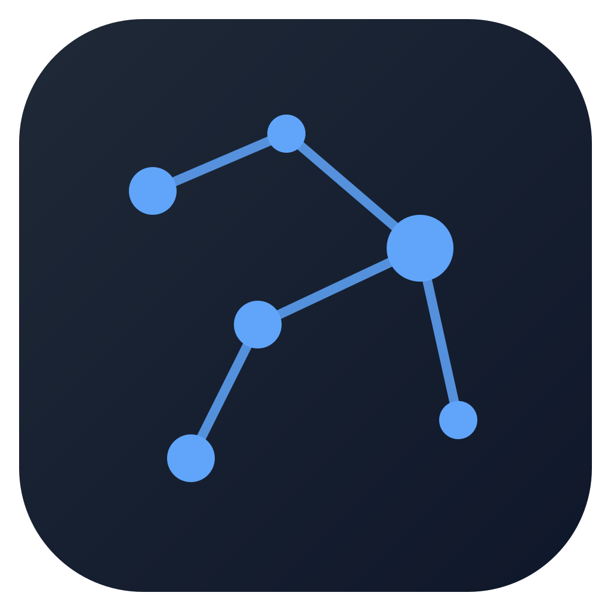

<p align="center">
  
</p>

# LocalML

Any Hugging Face model. Local. Multi-modal. Now a **local web server** with an
**OpenAI-compatible API** - no Electron, no native binary.

Run 143+ model families fully on-device (LLMs, VLMs, diffusion, ASR, TTS,
segmentation, detection) behind a browser UI, and point agent frameworks
(LangChain, LangGraph, the OpenAI SDK) at it the way you point them at Ollama.

## Install

Requires **Python 3.10+** - the installer checks for it but won't install Python
for you. One line in your terminal:

```bash
# macOS / Linux
curl -fsSL https://www.localml.tech/install.sh | sh
# Windows (PowerShell)
irm https://www.localml.tech/install.ps1 | iex
```

The script bootstraps pipx and installs the LocalML server. On first launch the
app walks you through installing the inference stack (PyTorch + transformers) for
your hardware - pick **CPU** or **GPU** and it fetches the matching build.

Prefer to do it by hand?

```bash
pipx install localml                 # server only; the app installs torch on first run
pipx install "localml[inference]"    # or grab the whole stack up front (generic torch wheel)
```

## Run

```bash
localml                 # starts the server and opens http://localhost:11500
localml --port 8080     # custom port
localml --host 0.0.0.0 --no-browser   # expose on the LAN, headless
```

Open the printed URL, download a model from the Hub tab, and run it.

## OpenAI-compatible API

Point any OpenAI client at `http://localhost:11500/v1` (any api key). It routes
to whichever LLM is currently loaded in LocalML.

```python
from openai import OpenAI
client = OpenAI(base_url="http://localhost:11500/v1", api_key="not-needed")
client.chat.completions.create(
    model="Qwen/Qwen2.5-0.5B-Instruct",
    messages=[{"role": "user", "content": "Hello!"}],
)
```

Supports streaming (`stream=True`), `GET /v1/models`, and tool/function calling
for the Qwen/Hermes, Llama, and Mistral families.

## Docker

```bash
docker build -t localml .
docker run --rm -p 11500:11500 localml            # CPU
docker run --rm --gpus all -p 11500:11500 localml # GPU
```

## Development

The React UI lives in `src/renderer/` (built with esbuild) and talks to the
server via `window.localml` (see `src/renderer/web-bridge.js`). The Python
server + inference engine live in `python/`.

```bash
npm install          # build deps (esbuild + the vendored UMD libs)
npm run build        # compile the renderer and bundle it into the package
pip install -e ".[inference]"
localml
```
